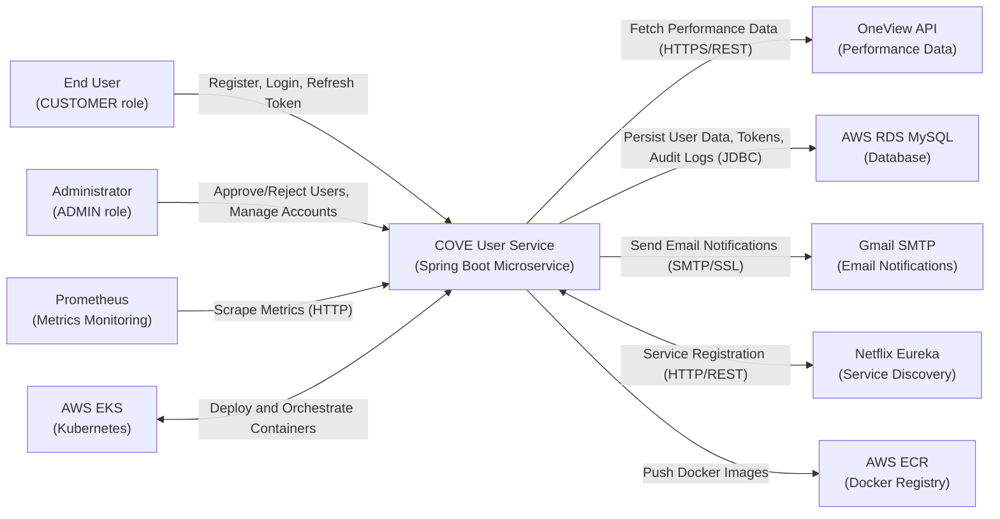
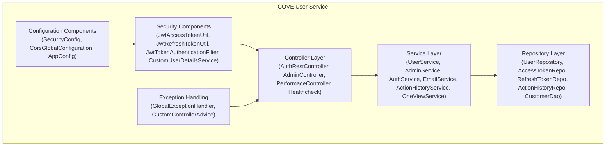
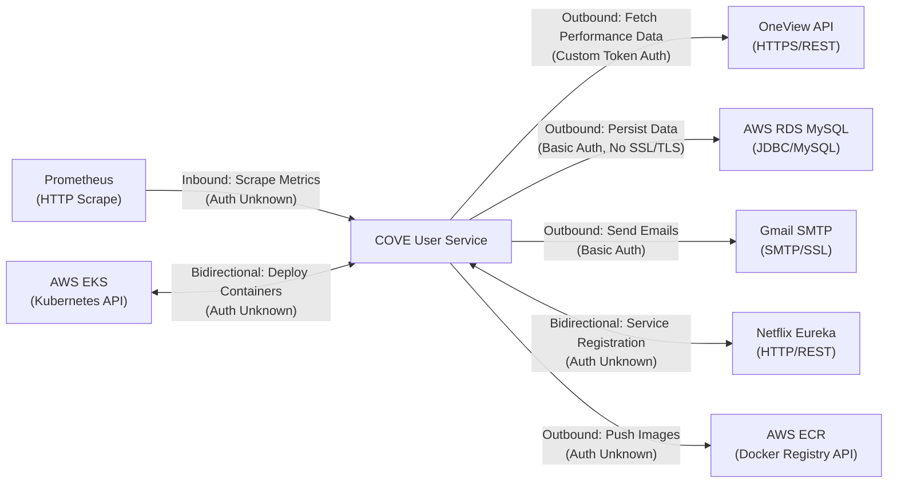
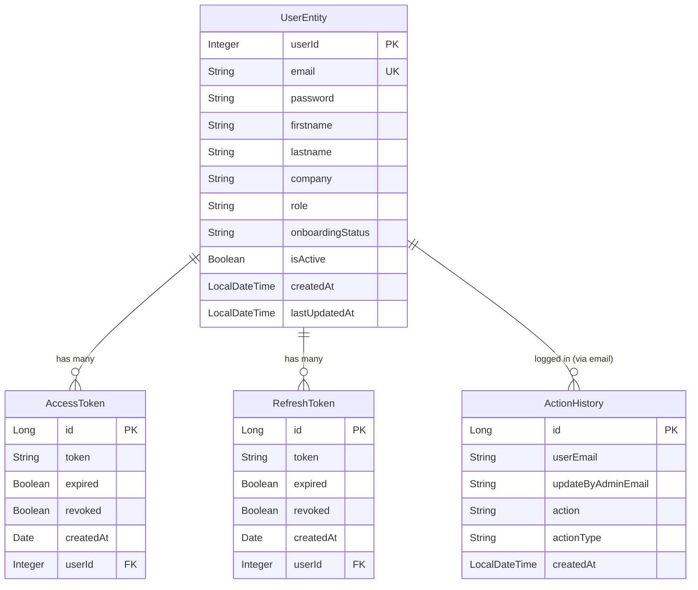
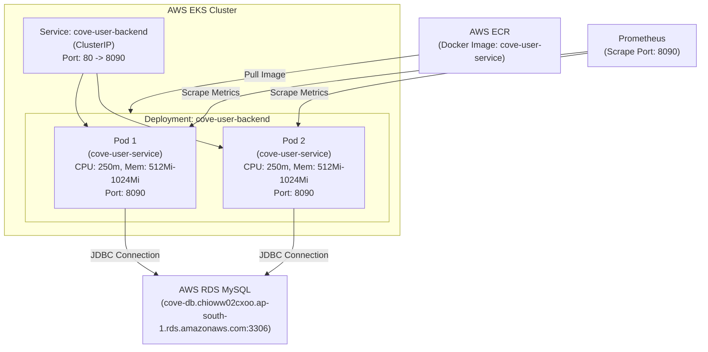

# COVE User Service — Architecture Diagrams

**Generated:** 2025-01-16 12:00:00 UTC  
**Repository:** ramanohar/AAVA-Reverse-Engineering-POC  
**Branch:** main

---

## Introduction

This document contains Mermaid diagrams for the COVE User Service architecture. All diagrams are synthesized from upstream reverse-engineering artifacts (repository_summary.json, dependency_graph.json, domain_model.json, integration_catalog.json, data_model.json, security_privacy_assessment.json, business_process_model.json). Diagrams are GitHub-renderable and cite source artifacts in comments.

---

## System Context Diagram

**Purpose:** Shows COVE User Service and its external systems (actors, integrations, and data sources).

<!-- sources: integration_catalog.json (touchpoints), business_process_model.json (actors), domain_model.json (bounded_contexts) -->

*Caption:* COVE User Service interacts with end users and administrators via REST API, integrates with OneView API for performance data, persists data in MySQL, sends email notifications via Gmail SMTP, registers with Eureka for service discovery, exposes metrics to Prometheus, and is deployed on AWS EKS with images stored in ECR.

---

## Container/Module Diagram

**Purpose:** Shows internal modules and layers within COVE User Service.

<!-- sources: dependency_graph.json (service_module_graph.nodes), repository_summary.json (modules) -->

*Caption:* COVE User Service follows a layered architecture with clear separation of concerns. Controllers handle HTTP requests, Services implement business logic, Repositories manage data access, Security Components enforce authentication and authorization, Configuration Components define application settings, and Exception Handlers manage error responses.

---

## Integration Landscape Diagram

**Purpose:** Shows major integration flows with direction and protocol.

<!-- sources: integration_catalog.json (touchpoint_enrichments) -->

*Caption:* COVE User Service integrates with seven external systems. Outbound integrations include OneView API (performance data), MySQL (persistence), Gmail SMTP (email notifications), and ECR (Docker images). Bidirectional integrations include Eureka (service discovery) and EKS (container orchestration). Inbound integration includes Prometheus (metrics scraping). Authentication patterns vary; critical gaps include missing SSL/TLS for MySQL and hardcoded credentials for OneView and Gmail.

---

## Data Flow Diagram (Logical)

**Purpose:** Shows primary data entities and relationships.

<!-- sources: data_model.json (logical_models, key_relationships), business_process_model.json (processes) -->

*Caption:* COVE User Service data model includes four primary entities: UserEntity (user accounts with onboarding status and activation state), AccessToken (short-lived JWT tokens), RefreshToken (long-lived JWT tokens), and ActionHistory (audit log for admin actions). Relationships are one-to-many from UserEntity to tokens (via foreign key userId) and logical association from UserEntity to ActionHistory (via userEmail).

---

## Deployment Diagram (AWS EKS)

**Purpose:** Shows Kubernetes deployment with replicas, resource limits, and service configuration.

<!-- sources: repository_summary.json (deployment, kubernetes_configuration), integration_catalog.json (AWS EKS touchpoint) -->

*Caption:* COVE User Service is deployed on AWS EKS with 2 replicas (Pods) in a Deployment named cove-user-backend. Each Pod runs the cove-user-service container with resource requests (250m CPU, 512Mi memory) and limits (250m CPU, 1024Mi memory). A ClusterIP Service exposes port 80 internally, routing traffic to Pod port 8090. Docker images are pulled from AWS ECR. Pods connect to AWS RDS MySQL for persistence. Prometheus scrapes metrics from each Pod on port 8090.

---

**End of Architecture Diagrams**
