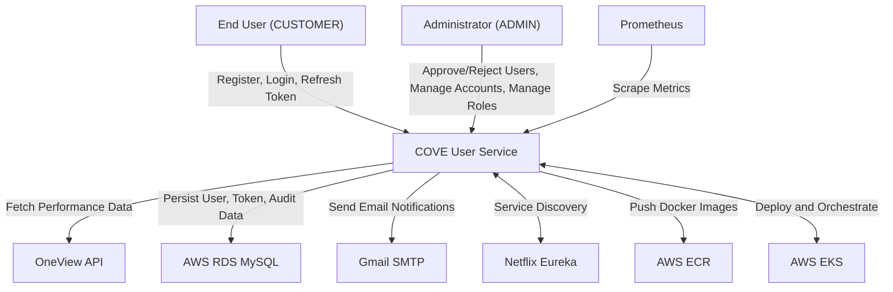
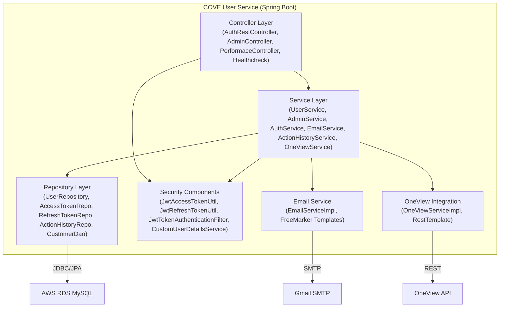
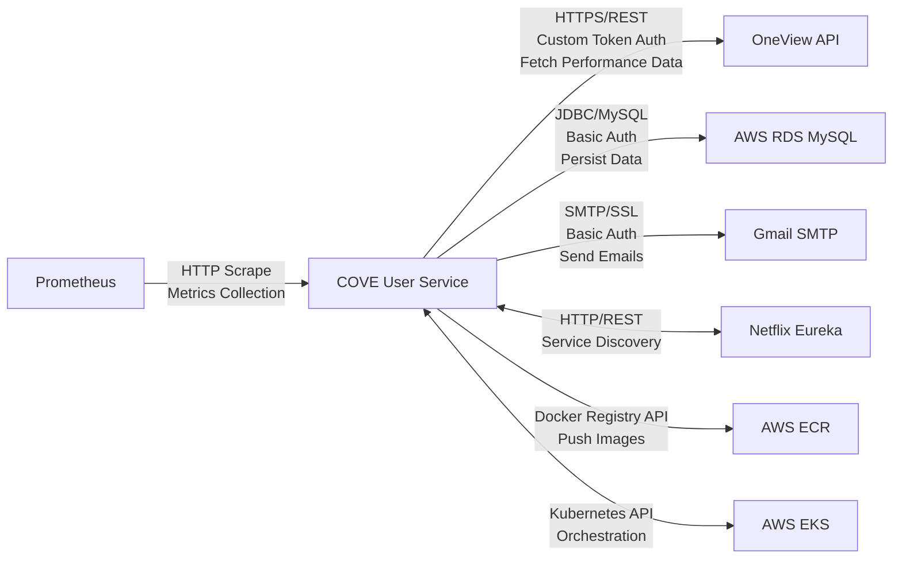
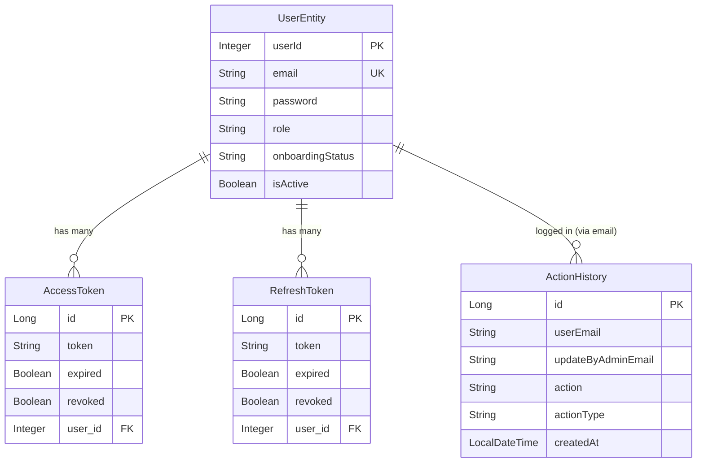
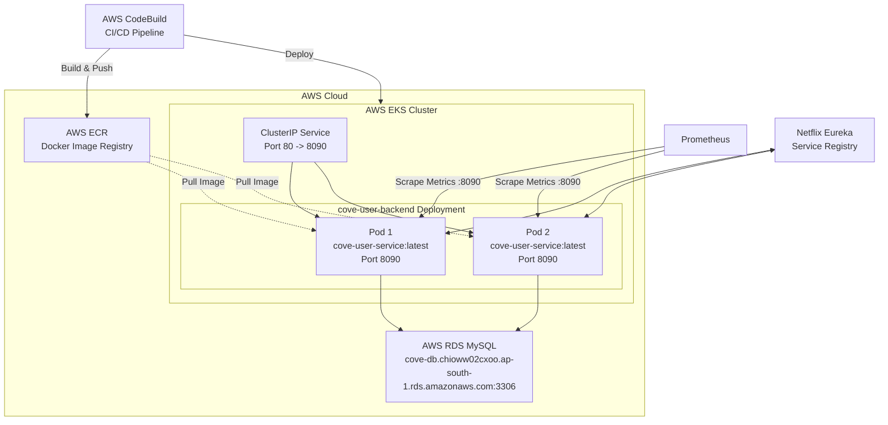

# COVE User Service - Architecture Diagrams

## Introduction

This document contains Mermaid diagrams visualizing the architecture of the COVE User Service. All diagrams are derived from upstream artifacts and represent the system as evidenced in the codebase. For detailed explanations, refer to `architecture_summary.md` and `architecture_summary.json`.

---

## System Context Diagram

This diagram shows the COVE User Service in its operational context, including primary users and external systems.

*Sources: integration_catalog.json (touchpoint_enrichments), business_process_model.json (application_purpose_summary)*

---

## Container/Module Diagram

This diagram shows the major internal modules and layers of the COVE User Service.

*Sources: dependency_graph.json (service_module_graph), repository_summary.json (modules)*

---

## Integration Landscape Diagram

This diagram shows the major integration flows between COVE User Service and external systems.

*Sources: integration_catalog.json (touchpoint_enrichments)*

---

## Data Flow Diagram (Logical)

This diagram shows the primary data entities and their relationships in the COVE User Service.

*Sources: data_model.json (logical_models, key_relationships)*

---

## Deployment Diagram (AWS EKS)

This diagram shows the deployment architecture of COVE User Service on AWS EKS.

*Sources: repository_summary.json (deployment, kubernetes_configuration)*

---

## Notes

- All diagrams are generated from upstream artifacts and represent the system as evidenced in the codebase.
- Diagrams use Mermaid syntax for GitHub rendering.
- For detailed explanations of each component and integration, refer to `architecture_summary.md` and `architecture_summary.json`.
- Security risks (hardcoded credentials, missing SSL/TLS, no rate limiting) are documented in `architecture_summary.json` under `operational_and_risk.residual_risks`.
