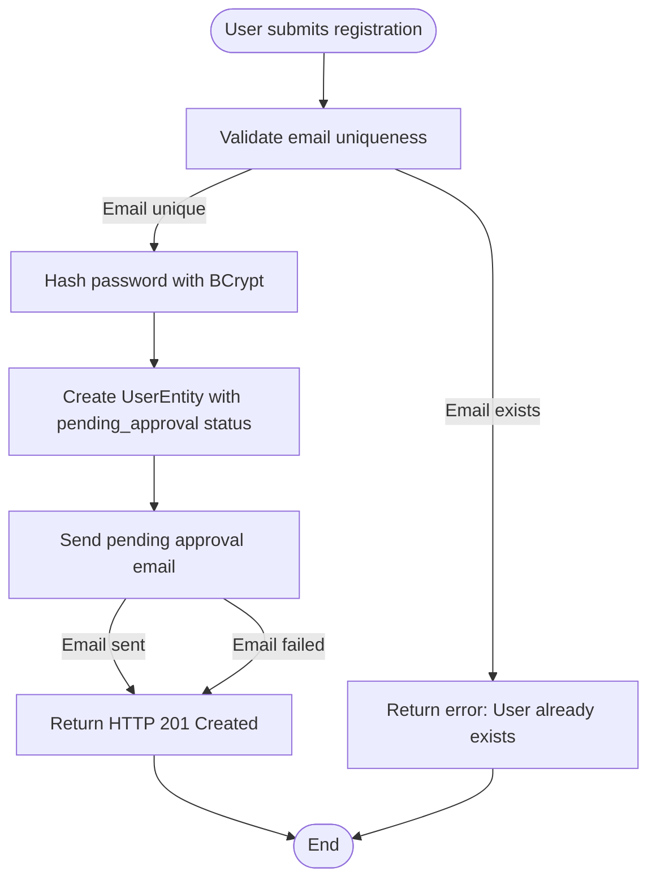
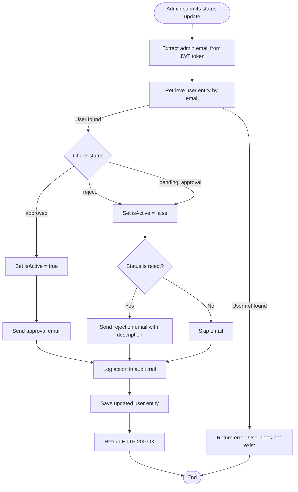
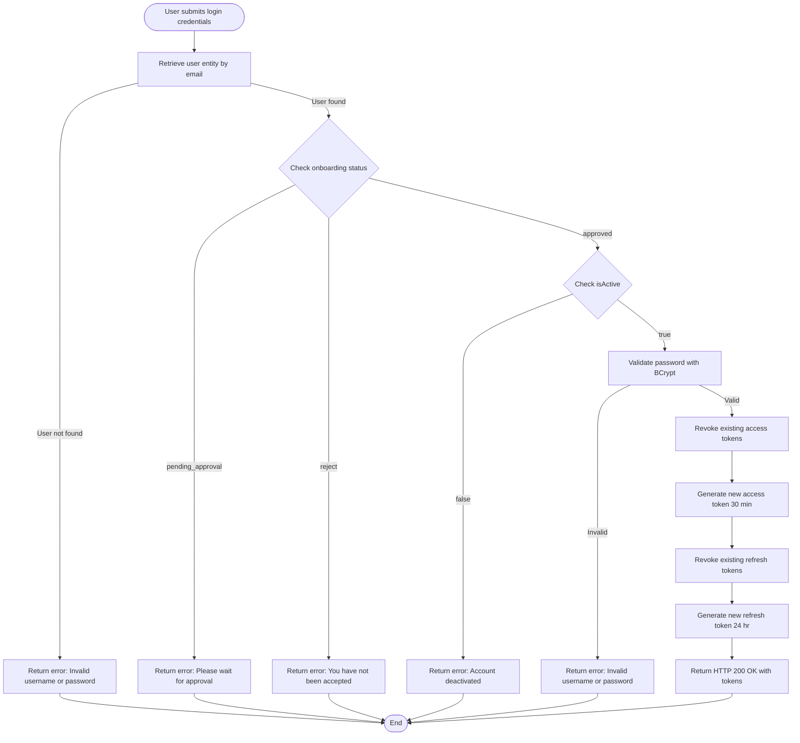
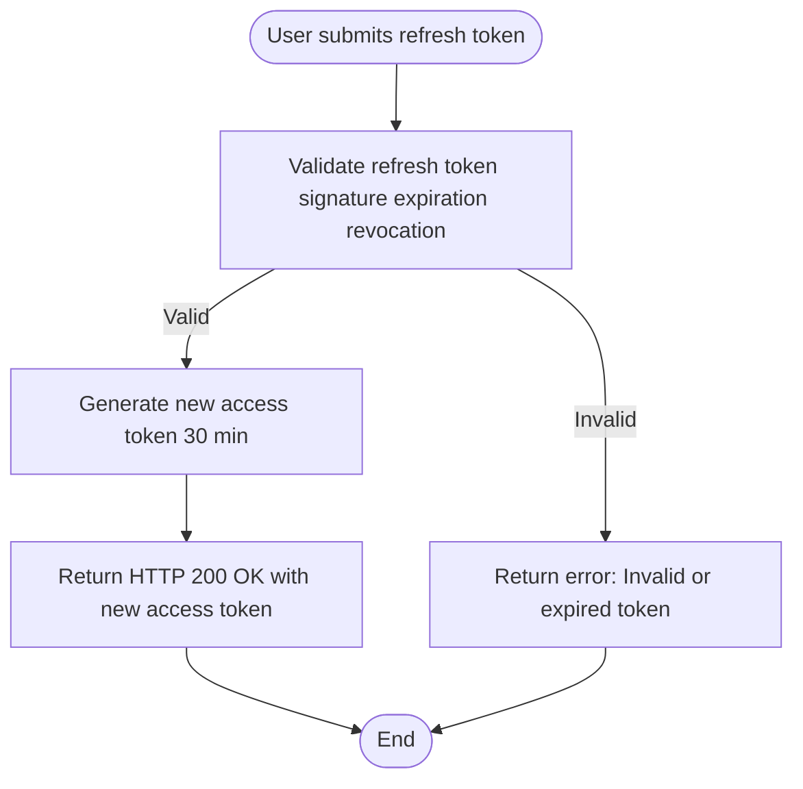
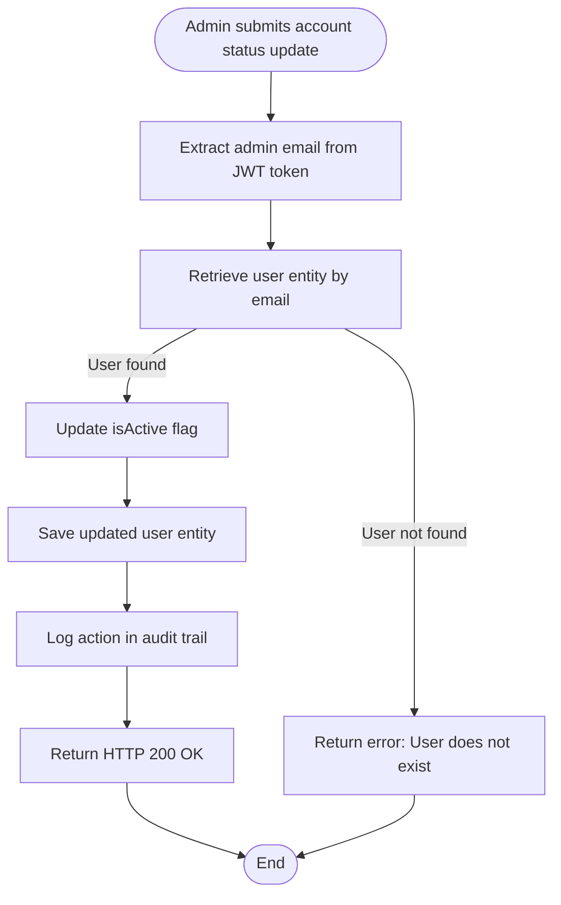
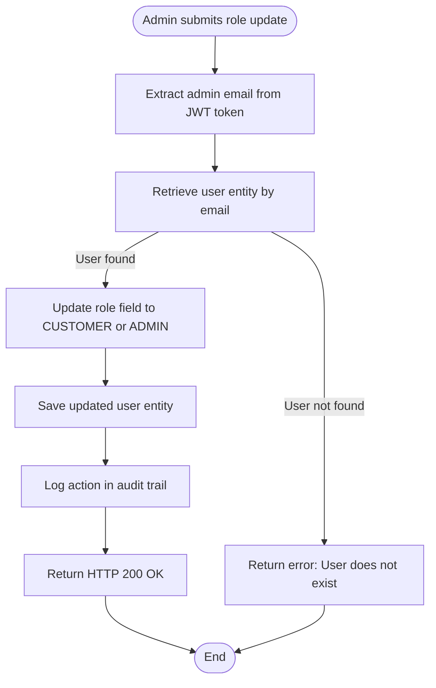
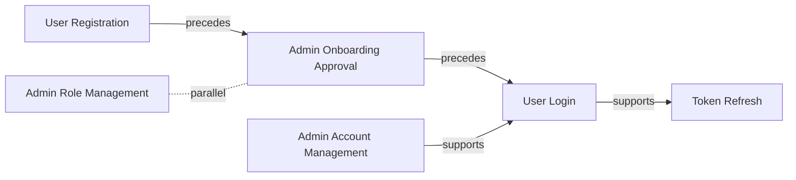

# COVE User Service — Business Process Model

## Executive Summary

COVE User Service is a reactive Spring Boot microservice that manages user authentication, registration, and onboarding workflows for the COVE platform. It provides JWT-based authentication with role-based access control (CUSTOMER and ADMIN roles), an admin-approval workflow for new user registrations, and integration with external OneView API for project performance data. The system is deployed on AWS EKS with automated CI/CD pipelines.

This document describes the core business processes that govern user lifecycle management, authentication, and administrative actions. Each process is illustrated with a Mermaid diagram and supported by evidence from the codebase and prerequisite artifacts.

**How to read this document:**
- **Primary Capabilities** section provides a high-level overview of what the system does.
- **Business Processes** section details each workflow with narrative, step-by-step descriptions, and diagrams.
- **Process Relationships** section explains how processes depend on or support each other.
- **Stakeholder FAQ** section answers common questions about system behavior.
- **Limits and Unknowns** section documents gaps in evidence and areas requiring further investigation.

---

## Primary Capabilities

The COVE User Service provides the following primary capabilities:

- **User Registration and Onboarding:** Allows new users to register with the system. Registrations enter a pending approval state and require admin review before users can authenticate. Email notifications are sent at each onboarding stage (pending, approved, rejected).

- **JWT-Based Authentication:** Provides stateless authentication using short-lived access tokens (30 minutes) and long-lived refresh tokens (24 hours). Tokens are stored in the database with expiration and revocation flags. Supports token refresh and revocation workflows.

- **Admin User Management:** Enables administrators to approve or reject user registrations, activate or deactivate user accounts, change user roles, and view user details with pagination and filtering. All admin actions are logged in an audit trail.

- **Audit and Compliance Logging:** Records all administrative actions on user accounts (onboarding status changes, account activation/deactivation, role changes) with timestamps and admin attribution. Provides paginated audit log retrieval with filtering.

- **External Performance Data Integration:** Integrates with external OneView API to fetch project performance metrics and RAG (Red-Amber-Green) status data for clients. Provides a single endpoint for performance data retrieval.

---

## Business Processes

### User Registration

**Process ID:** `proc_user_registration`

**Narrative:**

A new user submits registration details (email, password, name, company, etc.) via the `/register` endpoint. The system validates that the email is unique, hashes the password with BCrypt for secure storage, creates a user record with `pending_approval` status, and sends a pending approval email notification via Gmail SMTP. The user cannot authenticate until an administrator approves the registration.

This process is the entry point for all new users. It ensures that only valid, unique email addresses are registered and that passwords are securely hashed before storage. The pending approval state prevents unauthorized access while awaiting admin review.

**Actors:**
- **New User** (human): Individual registering for a COVE account
- **COVE User Service** (system): Processes registration request, validates data, stores user entity
- **Gmail SMTP** (system): Sends pending approval email notification

**Triggers:**
- POST `/register` with user registration payload (email, password, firstname, lastname, company, etc.)

**Steps:**

1. **Receive Registration Request:** User submits registration details via POST `/register` endpoint (AuthRestController)
2. **Validate Email Uniqueness:** System checks if email already exists in the database. If email exists, registration fails with error (UserServiceImpl)
3. **Hash Password:** System hashes the user's password using BCrypt before storage (UserServiceImpl)
4. **Create User Entity:** System creates a UserEntity with onboardingStatus set to `pending_approval`, isActive set to false, and stores it in the users table (UserServiceImpl)
5. **Send Pending Approval Email:** System sends an email notification to the user informing them that their registration is pending admin approval (EmailServiceImpl, Gmail SMTP integration)
6. **Return Success Response:** System returns HTTP 201 Created with success message to the user (UserServiceImpl)

**Variations:**
- **Email already exists:** If the email is already registered, the system throws a CustomException with status 400 and message 'User Creation Failed!'
- **Email send failure:** If email notification fails, the system throws a CustomException with code 451 but user registration still succeeds (email failure does not roll back user creation)

**Outcomes:**
- **Success:** User record created with `pending_approval` status; email notification sent; user awaits admin approval
- **Failure:** Registration fails due to duplicate email or system error; user receives error response

**Diagram:**

---

### Admin Onboarding Approval

**Process ID:** `proc_admin_onboarding_approval`

**Narrative:**

An administrator reviews a pending user registration and updates the onboarding status to `approved` or `rejected` via the `/api/v1/admin/{toEmail}/onboarding-status` endpoint. If approved, the user account is activated (isActive set to true) and an approval email is sent. If rejected, the account remains inactive and a rejection email with admin comments is sent. All actions are logged in the audit trail with admin attribution.

This process is the gatekeeper for user access. It ensures that only legitimate users gain access to the system and provides a mechanism for administrators to reject suspicious or invalid registrations. The audit trail ensures accountability and compliance.

**Actors:**
- **Administrator** (human): User with ADMIN role who reviews and approves/rejects registrations
- **COVE User Service** (system): Processes admin decision, updates user status, sends email notifications
- **Gmail SMTP** (system): Sends approval or rejection email notification

**Triggers:**
- PUT `/api/v1/admin/{toEmail}/onboarding-status` with status parameter (`approved`, `reject`, or `pending_approval`) and optional description

**Steps:**

1. **Receive Onboarding Status Update Request:** Admin submits onboarding status update via PUT endpoint with status and optional description (AdminController, requires ADMIN role)
2. **Extract Admin Email from Token:** System extracts the admin's email from the JWT access token to attribute the action (AdminServiceImpl)
3. **Retrieve User Entity:** System retrieves the user entity by email from the users table. If user not found, process fails with error (AdminServiceImpl)
4. **Update Onboarding Status and Account Activation:** System updates the user's onboardingStatus field. If status is `approved`, isActive is set to true. If status is `reject` or `pending_approval`, isActive is set to false (AdminServiceImpl)
5. **Send Email Notification:** System sends an email notification to the user based on the new status: approval email if approved, rejection email with description if rejected, no email if pending_approval (EmailServiceImpl, Gmail SMTP integration)
6. **Log Action in Audit Trail:** System creates an ActionHistory record with admin email, user email, new status, description, and action type (OnBoarding Status) (ActionHistoryServiceImpl)
7. **Save Updated User Entity:** System persists the updated user entity to the users table (AdminServiceImpl)
8. **Return Success Response:** System returns HTTP 200 OK with success message to the admin (AdminServiceImpl)

**Variations:**
- **Status is approved:** User account is activated (isActive = true) and approval email is sent
- **Status is reject:** User account remains inactive (isActive = false) and rejection email with admin comments is sent
- **Status is pending_approval:** User account remains inactive (isActive = false) and no email is sent
- **User not found:** Process fails with CustomException 400 'User does not exist'

**Outcomes:**
- **Approved:** User onboarding status updated to `approved`; account activated; approval email sent; action logged
- **Rejected:** User onboarding status updated to `reject`; account remains inactive; rejection email sent; action logged
- **Failure:** Update fails due to user not found or system error; admin receives error response

**Diagram:**

---

### User Login

**Process ID:** `proc_user_login`

**Narrative:**

An approved and active user submits login credentials (email and password) via the `/login` endpoint. The system validates the credentials, checks the user's onboarding status and account activation state, revokes any existing tokens, generates new access and refresh tokens, stores them in the database, and returns them to the user.

This process is the primary authentication mechanism for the system. It ensures that only approved and active users can obtain tokens, and it enforces a single-session model by revoking old tokens on each login. The use of BCrypt for password validation ensures secure credential verification.

**Actors:**
- **Registered User** (human): User with approved onboarding status and active account
- **COVE User Service** (system): Validates credentials, checks user status, generates and stores tokens

**Triggers:**
- POST `/login` with AuthenticationRequest payload (email, password)

**Steps:**

1. **Receive Login Request:** User submits login credentials via POST `/login` endpoint (AuthRestController, public endpoint)
2. **Retrieve User Entity:** System retrieves the user entity by email from the users table. If user not found, login fails with error (UserServiceImpl)
3. **Check Onboarding Status:** System checks the user's onboardingStatus. If not `approved`, login fails with appropriate error (`pending_approval`, `reject`, or invalid status) (UserServiceImpl)
4. **Check Account Activation:** System checks the user's isActive flag. If false, login fails with error 'Your account has been deactivated' (UserServiceImpl)
5. **Validate Password:** System compares the submitted password with the stored BCrypt hash. If passwords do not match, login fails with error 'Invalid username or password' (UserServiceImpl)
6. **Revoke Existing Access Tokens:** System revokes all existing access tokens for the user by setting revoked flag to true in the access_token table (JwtAccessTokenUtil)
7. **Generate New Access Token:** System generates a new JWT access token with 30-minute validity and stores it in the access_token table (JwtAccessTokenUtil)
8. **Revoke Existing Refresh Tokens:** System revokes all existing refresh tokens for the user by setting revoked flag to true in the refresh_token table (JwtRefreshTokenUtil)
9. **Generate New Refresh Token:** System generates a new JWT refresh token with 24-hour validity and stores it in the refresh_token table (JwtRefreshTokenUtil)
10. **Return Token Response:** System returns HTTP 200 OK with Token payload containing email, access token, and refresh token (UserServiceImpl)

**Variations:**
- **User not found:** Login fails with CustomException 403 'Invalid username or password'
- **Onboarding status is pending_approval:** Login fails with CustomException 403 'Please wait for an email confirmation of your approval'
- **Onboarding status is reject:** Login fails with CustomException 403 'Unfortunately, you have not been accepted'
- **Account is deactivated:** Login fails with CustomException 403 'Your account has been deactivated'
- **Password does not match:** Login fails with BadCredentialsException 'Invalid username or password'

**Outcomes:**
- **Success:** User authenticated successfully; new access and refresh tokens generated and returned; old tokens revoked
- **Failure:** Login fails due to invalid credentials, pending approval, rejection, deactivation, or system error; user receives error response

**Diagram:**

---

### Token Refresh

**Process ID:** `proc_token_refresh`

**Narrative:**

A user with a valid refresh token requests a new access token via the `/refresh-token` endpoint. The system validates the refresh token (signature, expiration, revocation status), retrieves the associated user, generates a new access token, and returns it to the user.

This process enables users to maintain authenticated sessions without re-entering credentials. It supports the short-lived access token model by allowing users to obtain new access tokens using their long-lived refresh tokens.

**Actors:**
- **Authenticated User** (human): User with a valid refresh token
- **COVE User Service** (system): Validates refresh token, generates new access token

**Triggers:**
- POST `/refresh-token` with token parameter (refresh token)

**Steps:**

1. **Receive Refresh Token Request:** User submits refresh token via POST `/refresh-token` endpoint (AuthRestController, public endpoint)
2. **Validate Refresh Token:** System validates the refresh token signature, expiration, and revocation status. If invalid, process fails with error (JwtRefreshTokenUtil, inferred from security assessment)
3. **Generate New Access Token:** System generates a new JWT access token with 30-minute validity (JwtRefreshTokenUtil, inferred)
4. **Return Refresh Token Response:** System returns HTTP 200 OK with RefreshTokenResponse containing the new access token (AuthServiceImpl)

**Variations:**
- **Refresh token is invalid, expired, or revoked:** Process fails with error; user must re-authenticate

**Outcomes:**
- **Success:** New access token generated and returned; user can continue authenticated session
- **Failure:** Token refresh fails due to invalid or expired refresh token; user receives error response and must re-authenticate

**Diagram:**

---

### Admin Account Management

**Process ID:** `proc_admin_account_management`

**Narrative:**

An administrator activates or deactivates a user account via the `/api/v1/admin/{toEmail}/account-status` endpoint. The system updates the user's isActive flag, logs the action in the audit trail, and returns a success response. No email notification is sent for account status changes.

This process provides administrators with the ability to temporarily disable user access without deleting the user record. It is useful for handling security incidents, policy violations, or temporary suspensions.

**Actors:**
- **Administrator** (human): User with ADMIN role who manages user account activation
- **COVE User Service** (system): Processes admin decision, updates user account status, logs action

**Triggers:**
- PUT `/api/v1/admin/{toEmail}/account-status` with status parameter (true for activate, false for deactivate) and optional description

**Steps:**

1. **Receive Account Status Update Request:** Admin submits account status update via PUT endpoint with status (boolean) and optional description (AdminController, requires ADMIN role)
2. **Extract Admin Email from Token:** System extracts the admin's email from the JWT access token to attribute the action (AdminServiceImpl)
3. **Retrieve User Entity:** System retrieves the user entity by email from the users table. If user not found, process fails with error (AdminServiceImpl)
4. **Update Account Status:** System updates the user's isActive flag to the specified status (true for activated, false for deactivated) (AdminServiceImpl)
5. **Save Updated User Entity:** System persists the updated user entity to the users table (AdminServiceImpl)
6. **Log Action in Audit Trail:** System creates an ActionHistory record with admin email, user email, new account status (Activated or Deactivated), description, and action type (Account Status) (ActionHistoryServiceImpl)
7. **Return Success Response:** System returns HTTP 200 OK with success message to the admin (AdminServiceImpl)

**Variations:**
- **User not found:** Process fails with CustomException 400 'User does not exist'

**Outcomes:**
- **Success:** User account status updated; action logged; admin receives success response
- **Failure:** Update fails due to user not found or system error; admin receives error response

**Diagram:**

---

### Admin Role Management

**Process ID:** `proc_admin_role_management`

**Narrative:**

An administrator changes a user's role (CUSTOMER or ADMIN) via the `/api/v1/admin/{toEmail}/role` endpoint. The system updates the user's role field, logs the action in the audit trail, and returns a success response. No email notification is sent for role changes.

This process enables administrators to promote users to admin status or demote admins to customer status. It supports flexible role-based access control and allows for dynamic permission management.

**Actors:**
- **Administrator** (human): User with ADMIN role who manages user roles
- **COVE User Service** (system): Processes admin decision, updates user role, logs action

**Triggers:**
- PUT `/api/v1/admin/{toEmail}/role` with role parameter (CUSTOMER or ADMIN) and optional description

**Steps:**

1. **Receive Role Update Request:** Admin submits role update via PUT endpoint with role and optional description (AdminController, requires ADMIN role)
2. **Extract Admin Email from Token:** System extracts the admin's email from the JWT access token to attribute the action (AdminServiceImpl)
3. **Retrieve User Entity:** System retrieves the user entity by email from the users table. If user not found, process fails with error (AdminServiceImpl)
4. **Update User Role:** System updates the user's role field to the specified role (CUSTOMER or ADMIN, converted to uppercase) (AdminServiceImpl)
5. **Save Updated User Entity:** System persists the updated user entity to the users table (AdminServiceImpl)
6. **Log Action in Audit Trail:** System creates an ActionHistory record with admin email, user email, new role, description, and action type (Role Status) (ActionHistoryServiceImpl)
7. **Return Success Response:** System returns HTTP 200 OK with success message to the admin (AdminServiceImpl)

**Variations:**
- **User not found:** Process fails with CustomException 400 'User does not exist'

**Outcomes:**
- **Success:** User role updated; action logged; admin receives success response
- **Failure:** Update fails due to user not found or system error; admin receives error response

**Diagram:**

---

## How Processes Relate

The following diagram illustrates the relationships between the core business processes:

**Relationship Descriptions:**

- **User Registration → Admin Onboarding Approval (precedes):** User registration creates a pending approval record that triggers the admin onboarding approval process. A user cannot proceed to login until an admin approves their registration.

- **Admin Onboarding Approval → User Login (precedes):** Admin approval (with approved status) enables the user to proceed with login. Only approved users can authenticate.

- **User Login → Token Refresh (supports):** Login generates a refresh token that is used in the token refresh process to obtain new access tokens without re-authentication.

- **Admin Account Management → User Login (supports):** Admin account deactivation prevents user login; account activation re-enables login. This process controls user access at the account level.

- **Admin Role Management ↔ Admin Onboarding Approval (parallel):** Admin role management and onboarding approval are independent admin functions that can be performed in any order. They do not have a strict dependency.

---

## Stakeholder FAQ

**Q: What happens after a user registers?**

A: After registration, the user receives a pending approval email and must wait for an administrator to review and approve their account. The user cannot log in until approved.

**Q: How long are access tokens valid?**

A: Access tokens are valid for 30 minutes. Refresh tokens are valid for 24 hours. Users can use the refresh token to obtain a new access token without re-authenticating.

**Q: What happens if an admin deactivates a user account?**

A: If an admin deactivates a user account, the user will receive an error message when attempting to log in. The user's existing tokens remain valid until they expire, but the user cannot obtain new tokens.

**Q: Are admin actions audited?**

A: Yes, all admin actions (onboarding approval/rejection, account activation/deactivation, role changes) are logged in the action_history table with timestamps and admin attribution.

**Q: Can users reset their passwords?**

A: No, password reset functionality is not currently implemented in the system.

---

## Limits and Unknowns

The following gaps and limitations were identified during the analysis:

- **Token refresh process implementation details are partially inferred from security assessment;** detailed code for `JwtRefreshTokenUtil.generateNewRefreshToken` was not read. The exact token generation and validation logic is assumed based on security patterns.

- **Token revocation logic details are inferred from login flow;** explicit revocation endpoint behavior was not fully traced. The revocation mechanism is assumed to set flags in the database.

- **Email template content and rendering logic not analyzed;** only service-level email sending logic was reviewed. The actual email content and formatting are not documented.

- **OneView API integration process not included as a primary business process** (external data retrieval, not core user management workflow). This integration is mentioned in capabilities but not detailed as a process.

- **Admin user listing and filtering process not included** (read-only query, not a state-changing workflow). This is a supporting function but not a core business process.

- **Action history retrieval process not included** (read-only query, not a state-changing workflow). This is a supporting function for audit review.

- **Healthcheck endpoint not included** (infrastructure monitoring, not a business process).

- **No workflow engine or batch processing detected;** all processes are synchronous API-driven. There is no evidence of asynchronous or scheduled workflows.

- **No explicit business rules engine detected;** validation and decision logic is embedded in the service layer. Business rules are not externalized.

- **No evidence of scheduled jobs or background processes for user management.** All processes are triggered by API requests.

---

## Evidence and Traceability

All process descriptions, steps, and diagrams in this document are grounded in evidence from the codebase and prerequisite artifacts. For detailed evidence paths and confidence levels, refer to the machine-readable `business_process_model.json` file in the same directory.

Key evidence sources:
- `src/main/java/com/collaberadigital/cove/controller/impl/AuthRestController.java`
- `src/main/java/com/collaberadigital/cove/controller/impl/AdminController.java`
- `src/main/java/com/collaberadigital/cove/service/impl/UserServiceImpl.java`
- `src/main/java/com/collaberadigital/cove/service/impl/AdminServiceImpl.java`
- `src/main/java/com/collaberadigital/cove/service/impl/AuthServiceImpl.java`
- `src/main/java/com/collaberadigital/cove/service/impl/EmailServiceImpl.java`
- `src/main/java/com/collaberadigital/cove/service/impl/ActionHistoryServiceImpl.java`
- `aava-demo/reverse-engineering/artifacts/repository_summary.json`
- `aava-demo/reverse-engineering/artifacts/domain_model.json`
- `aava-demo/reverse-engineering/artifacts/security_privacy_assessment.json`
- `aava-demo/reverse-engineering/artifacts/integration_catalog.json`
- `aava-demo/reverse-engineering/artifacts/data_model.json`

---

**Document Version:** 1.0  
**Generated:** 2025-01-16T12:00:00Z  
**Repository:** ramanohar/AAVA-Reverse-Engineering-POC  
**Branch:** main
